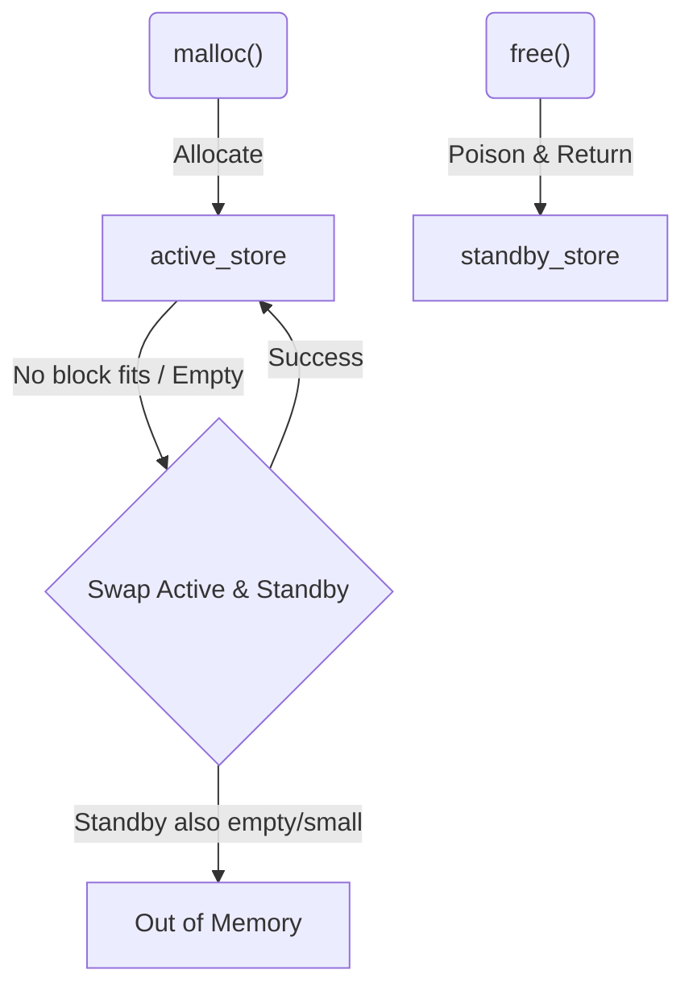

# ASan Baremetal Runtime Design Notes

## Generational Heap Quarantine

To detect Use-After-Free (UAF) violations effectively without the overhead of a complex FIFO queue (which requires extra pointer tracking and dynamic memory), we use a **Generational Quarantine** mechanism integrated into the heap allocator.

### Architecture

Instead of a single `FreeStore` (which holds the allocator's free list headers and trie root), we maintain two distinct generations:

1.  **`active_store`:** The generator from which `malloc()` calls always allocate memory.
2.  **`standby_store`:** The quarantine generation where `free()` calls always insert freed blocks.

### Allocation and Free Flow

*   **`malloc(size)`:**
    1.  Attempt allocation from `active_store`.
    2.  If allocation fails (due to OOM or fragmentation):
        *   Swap the pointers: `std::swap(active_store, standby_store)`.
        *   Attempt allocation from the *new* `active_store`.
        *   If it fails again, return `nullptr` (OOM).
    3.  If allocation succeeds, unpoison the user memory area and return the pointer.

*   **`free(ptr)`:**
    1.  Recover the allocation block and size from the ASan header.
    2.  Poison the block memory with `0xfd` (Heap Use-After-Free).
    3.  Check physical neighbors for coalescing:
        *   If a neighbor is free, determine which `FreeStore` (Active or Standby) currently holds it.
        *   Remove the neighbor from its owning `FreeStore`.
        *   Coalesce the blocks.
    4.  Insert the coalesced block into `standby_store`.

### Trade-offs
*   **Safety vs Memory Pressure:** Under low memory conditions, the `active_store` will exhaust quickly, triggering frequent swaps. This naturally reduces the quarantine lifetime of freed blocks to guarantee application availability. Under high memory availability, blocks remain quarantined much longer.
*   **Complexity:** $O(1)$ swap time, and list removals remain $O(1)$ or $O(\log N)$ without requiring a separate queue traversal.
