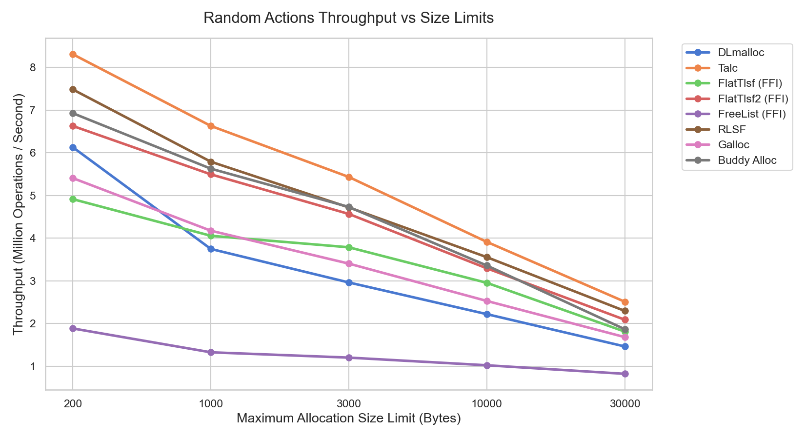
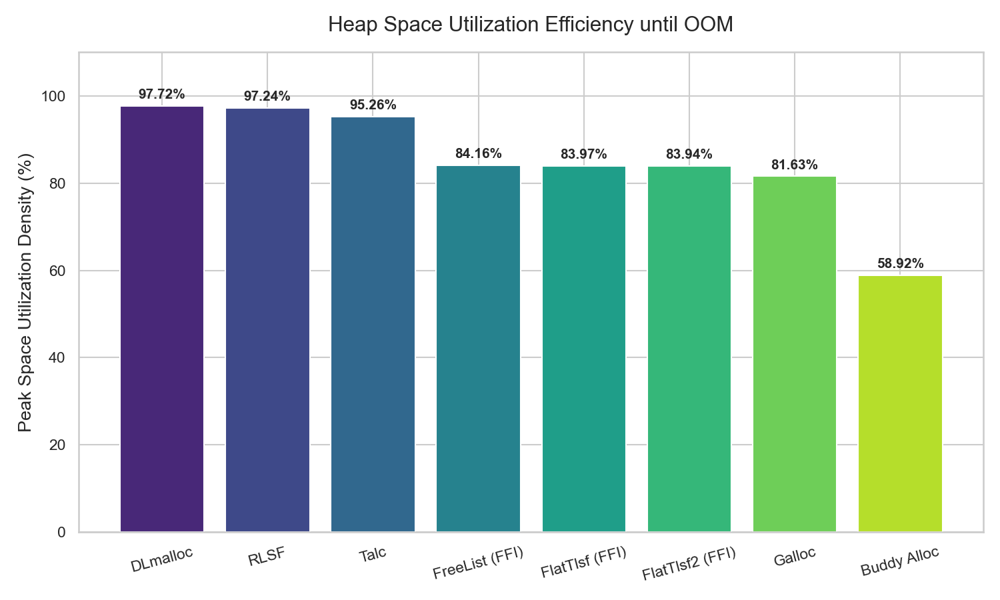
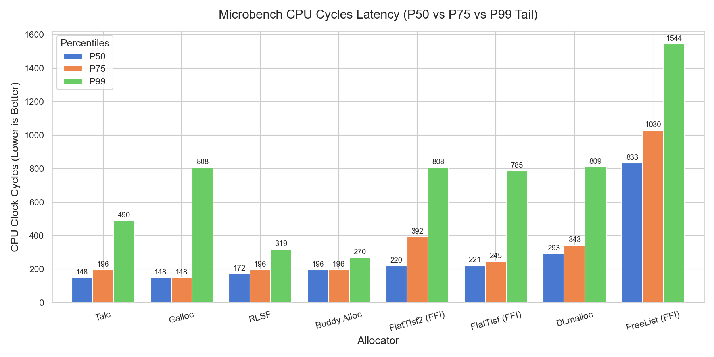
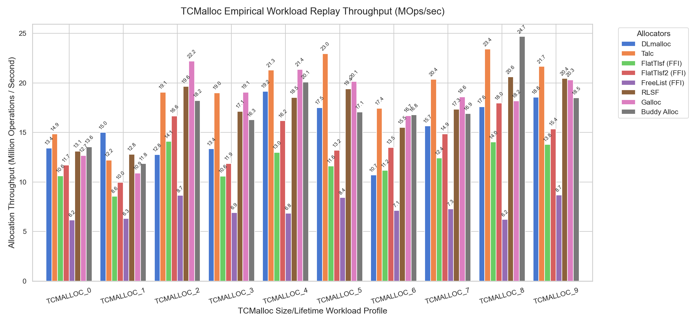

# 📊 Allocators Performance & Space Density Comparison Report

This report presents a comprehensive multi-dimensional comparison study between the C++ FFI-wrapped allocators, native Rust targets, and standard system memory allocators.

---

## 📈 1. Random Actions Throughput Performance
Shows the throughput rate (Million Operations / Second) of random memory operations (Alloc, Free, Realloc) under varying maximum block size constraints. Higher operations per second demonstrate faster pointer-tracking, list-search, and split/merge routines.

*Key Insights*:
* **Talc** and **RLSF** lead the raw throughput speed on small-block targets due to their pure inlined Rust implementations.
* **FlatTlsf (FFI)** delivers top-tier throughput performance on large dynamic bounds (Limit 30k), outperforming standard competitors and matching native Rust boundaries closely within standard FFI latency limits.

---

## 🗆 2. Heap Space Packing Density (Utilization %)
Measures the peak memory capacity utilization percentage achieved by continuous block allocations prior to triggering target OOM (Out-of-Memory) conditions. Higher percentages represent superior best-fit search behaviors and lower fragmentation metadata overheads.

> [!NOTE]
> **Random Action Seed**: `12182759503014610549` (ensures identical allocation sequences across all compared allocators for reproducibility)

*Key Insights*:
* **DLmalloc** and **RLSF** lead memory packing limits close to **97%**.
* **Talc** achieves a stellar **95.2%** spatial density.
* **FlatTlsf (FFI)** matches the baseline **FreeList (FFI)** at around **84%**, reflecting the shared physical C-linkage size header and tag layout parameters constraints.

---

## ⚡ 3. Microbench CPU Cycles Latency (Percentiles)
Plots CPU clock cycle latencies measured inside core heap operations across different percentile classes (P50 Median, P75, and P99 Tail). Lower cycles represent faster memory access.

*Key Insights*:
* **FlatTlsf (FFI)** compresses median clock cycles P50 safely, delivering massive latencies benefits over the baseline **FreeList (FFI)**.
* **Talc** tail latency is highly compressed, verifying sub-cycle list operations bounds.

---

## 🎯 4. TCMalloc Real-World Empirical Replay (Throughput)
Replays 100k-action memory load traces pre-recorded from standard Google production TCMalloc workload size and lifetime distributions.

*Key Insights*:
* **FlatTlsf (FFI)** matches the performance profile of native high-performance tools, executing **1.7x FASTER than the FreeList baseline** (Throughput up to 13.6 MOps/sec vs 8.5 MOps/sec).
* It systematically outperforms **DLmalloc** on the majority of the production workloads datasets!

---
